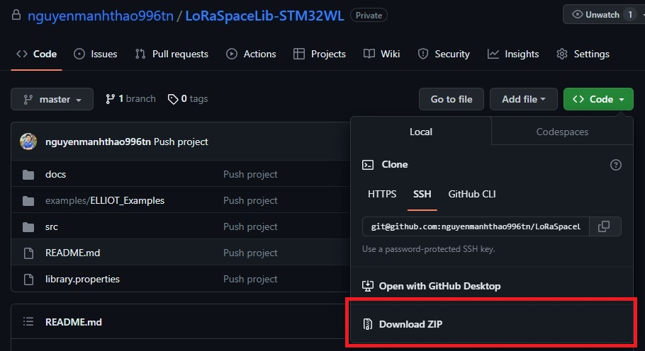
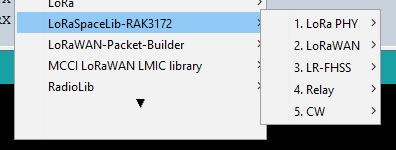

# LoRaSpaceLib for RAK3172 (STM32WL)


This reposistory aim to deploy the LoRaSpaceLib on [RAK3172](https://store.rakwireless.com/products/wisduo-lpwan-module-rak3172) (STM32WLE55CCUx) using [STM32duino Core](https://github.com/stm32duino/Arduino_Core_STM32).

# Installation

## Requirement
  - [ArduinoIDE](https://www.arduino.cc/en/software) (It's highly recommended to use the **Legacy IDE Version** *at least version v1.6.8*)
  - [stm32duino/Arduino_Core_STM32](https://github.com/stm32duino/Arduino_Core_STM32)
  - A device with [RAK3172](https://store.rakwireless.com/products/wisduo-lpwan-module-rak3172) integrated

## Setup Guide
  1. Download this reposistory as ZIP



  2. Open ArduinoIDE, go to **Sketch** -> **Include Library** -> **Add .ZIP Library...** and browse for the downloaded ZIP file in **step 1**.
  3. (Optional) Restart ArduinoIDE
  4. Plug your RAK3172 board to your PC
  5. Go to **Tool** menu, config as following *(Port selection is depend on your PC)*


  6. Go to **File** -> **Examples** -> **LoRaSpaceLib-RAK3172** & select your sketch.



  7. Click **Upload** (Ctrl + U) & enjoy!

# FAQ

### <u>Is this library Low-power</u>?

**No**, the library currently using polling for reading IRQ. Radio Interrupts & sleep function will be implemented later.

### <u>What is the default syncword for LR-FHSS packets</u>?

It's ```2C 0F 79 95```.

```
const uint8_t lr_fhss_sync_word[4] = {0x2C, 0x0F, 0x79, 0x95};
```

### <u>Can this library communicate with LoRaWAN Satellites</u>?

Technically, **Yes if you send LR-FHSS packets in the approriate format & configuration**. However, communicating between devices on Earth and Satellites is quite challenging and required some special aspects. I would recommended you to contact Lacuna Space for accessing of their LoRaWAN Satellites and RFThings for antennas/RF advises.

# To-do
  - [x] Propose the To-do list 😂
  - [x] Library functionalities
    - [x] LoRa PHY Send/Receive
    - [x] LoRaWAN ABP Uplink/Downlink
    - [x] LR-FHSS
    - [x] LoRaWAN over LR-FHSS
    - [x] Send to relay
    - [x] Receive from Relay
    - [x] CW
  - [x] Integrate RF Switch controlling into the library
  - [x] Implement function of changing the LR-FHSS syncword
  - [ ] Support interrupts (**via EXTI** and via **Radio Interrupt**) for Low-power activities
  - [x] Write installation guide
  - [x] Write FAQ section
  - [ ] Propose tests/test results to verify all Parameters
  - [ ] Merge library with other sx126x/lr11xx hardware library (DKAIoT, Gemini)
  - [ ] Customize STM32Duino Core

---

##### Maintained by M.T.
