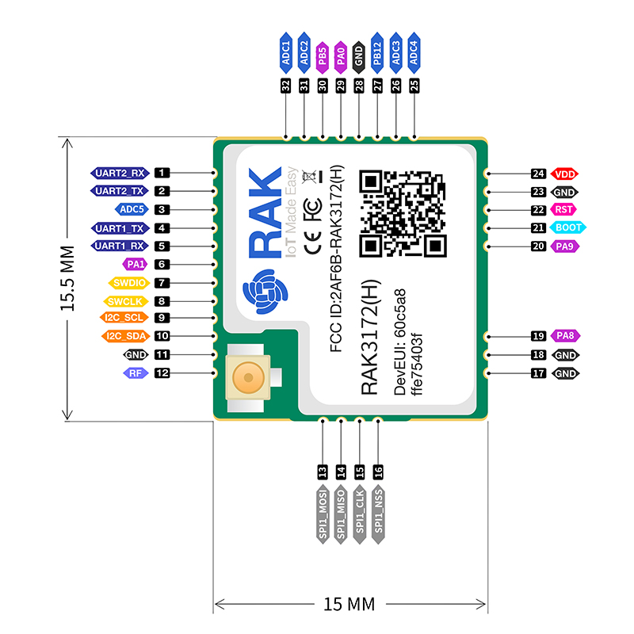
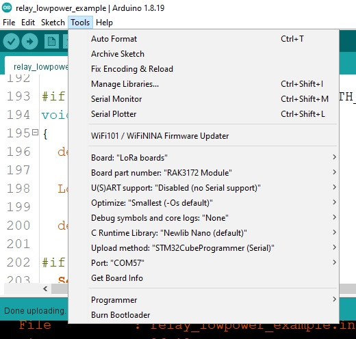

# 🛰 LoRaSpaceLib 🛰 for RAK3172 (STM32WL)



This reposistory aim to deploy the LoRaSpaceLib on [RAK3172](https://store.rakwireless.com/products/wisduo-lpwan-module-rak3172) (STM32WLE55CCUx) using [STM32duino Core](https://github.com/stm32duino/Arduino_Core_STM32).

# Installation

## Requirement

### 💾 Software

  - [ArduinoIDE](https://www.arduino.cc/en/software) (highly recommended to use the **Legacy IDE Version** *at least version v1.6.8*)
  - [stm32duino/Arduino_Core_STM32](https://github.com/stm32duino/Arduino_Core_STM32) (***version >= 1.3.0** is recommended*)
  
### ⚙ Hardware
  
  - A device with [RAK3172](https://store.rakwireless.com/products/wisduo-lpwan-module-rak3172) integrated
  - A USB TTL connect to UART2 of RAK3172 module to program it

### Additional Libraries

These below libraries are OPTIONAL. They are only used in ```relay_lowpower_example.ino``` & ```STM32WL-Lowpower.ino```.
  
  - [stm32duino/STM32LowPower](https://github.com/stm32duino/STM32LowPower)
  - [stm32duino/STM32RTC](https://github.com/stm32duino/STM32RTC)

## Setup Guide

  0. Download & install the required software listed in [the previous section](#software)
  1. Download this reposistory as ZIP


  2. Open ArduinoIDE, go to **Sketch** -> **Include Library** -> **Add .ZIP Library...** and browse for the downloaded ZIP file in **step 1**.
  3. (Optional) Restart ArduinoIDE
  4. Plug your RAK3172 board to your PC
  5. Go to **Tool** menu, config as following *(Port selection is depend on your PC)*



  6. Go to **File** -> **Examples** -> **LoRaSpaceLib-RAK3172** & select your sketch.


  7. Trigger Bootloader Mode in your board & Click **Upload** (Ctrl + U) & enjoy!

# FAQ ⁉

### <u>Can this library communicate with LoRaWAN Satellites</u>?

Technically, **Yes if you send LR-FHSS packets in the approriate format & configuration**. However, communicating between devices on Earth and Satellites is quite challenging and required some special aspects. I would recommended you to contact Lacuna Space for accessing of their LoRaWAN Satellites and RFThings for antennas/RF advises.

### <u>What is the default syncword for LR-FHSS packets</u>?

It's ```2C 0F 79 95```. You can change it with ```void set_lrfhss_syncword(uint32_t syncword);``` function.

```
const uint8_t lr_fhss_sync_word[4] = {0x2C, 0x0F, 0x79, 0x95};
```

### <u>Is this library Low-power</u>?

It's mostly depend on your application source code.

All examples in this library except for ```relay_lowpower_example.ino``` & ```STM32WL-Lowpower.ino``` are non-low-power to keep it simple.

For Low-power relay activity, ```relay_lowpower_example.ino``` example can archived the average current consumption of **~150 uA**. However, this value is not the best case senario. You can change the ```RX SYMBOL```, ```SLEEP INTERVAL``` & ```SLEEP Mode``` to gain more battery lifetime. These configuration should be optimized according to the actual deployment. Refer to [docs folder](./docs/relay_lowpower_pwr_results/) for more information on measurement results.


For other normally sleep (without using of Radio while sleeping), refer to [STM32WL-Lowpower](./examples/6.%20Others/STM32WL-Lowpower/). Measurement results are available in [docs folder](./docs/stm32wl-lowpower-measurement-results/).


### If you have any question or discussion points, please let me know via the Issues & Disscussions tabs 💖

# 🍀 Credits

Thanks **Côte d'Azur University** & [**RFThings CO.,Ltd.**](https://github.com/RFThings) for lending me the hardware. The original LoRaSpaceLib is also developed by [RFThings](https://github.com/RFThings).

# 🏁 To-do
  - [x] Propose the To-do list 😂
  - [x] Library functionalities
    - [x] LoRa PHY Send/Receive
    - [x] LoRaWAN ABP Uplink/Downlink
    - [x] LR-FHSS
    - [x] LoRaWAN over LR-FHSS
    - [x] Send to relay
    - [x] Receive from Relay
    - [x] CW
    - [x] MCU Stop mode
  - [x] Integrate RF Switch controlling into the library
  - [x] Implement function of changing the LR-FHSS syncword
  - [x] Support interrupts (**via EXTI** and via **Radio Interrupt**) for Low-power activities
  - [x] Write installation guide
  - [x] Write FAQ section
  - [ ] Propose tests/test results to verify all Parameters
  - [ ] Merge library with other sx126x/lr11xx hardware library (DKAIoT, Gemini)
  - [ ] Customize STM32Duino Core

---

##### Maintained by M.T.
